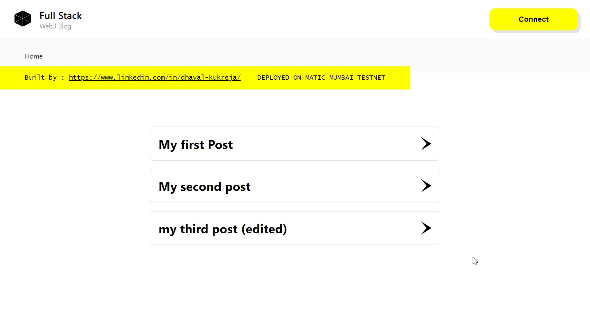
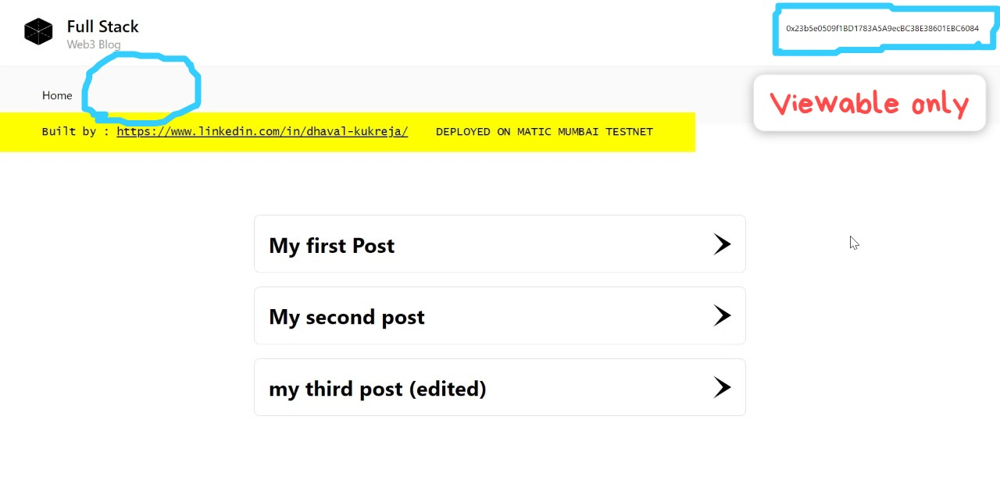
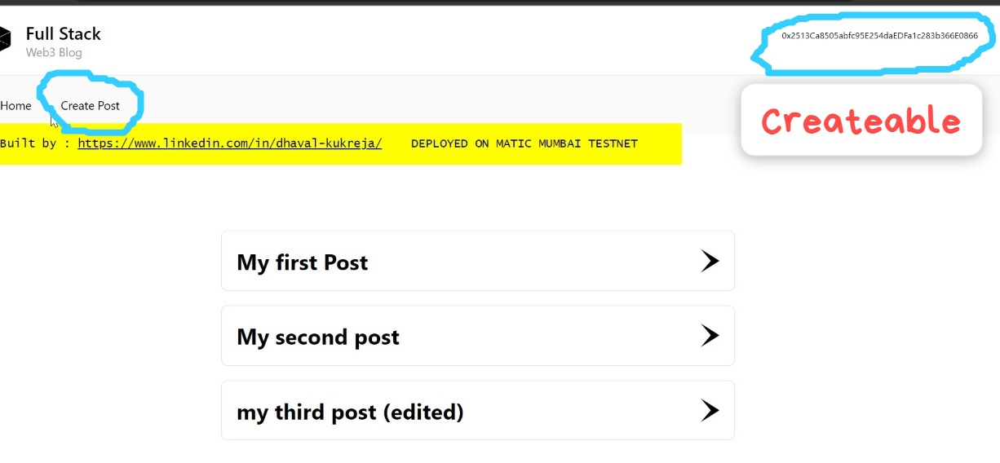
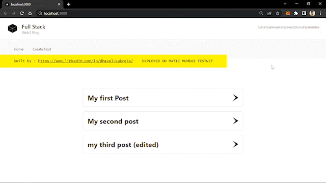
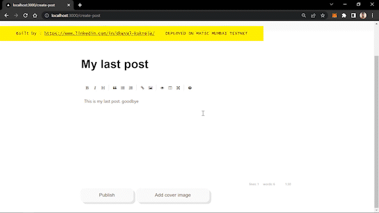
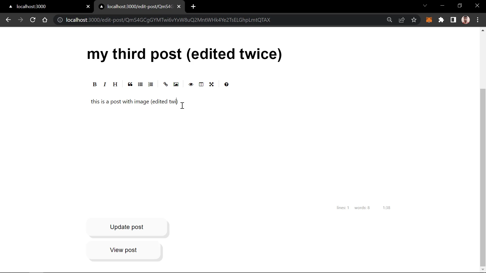
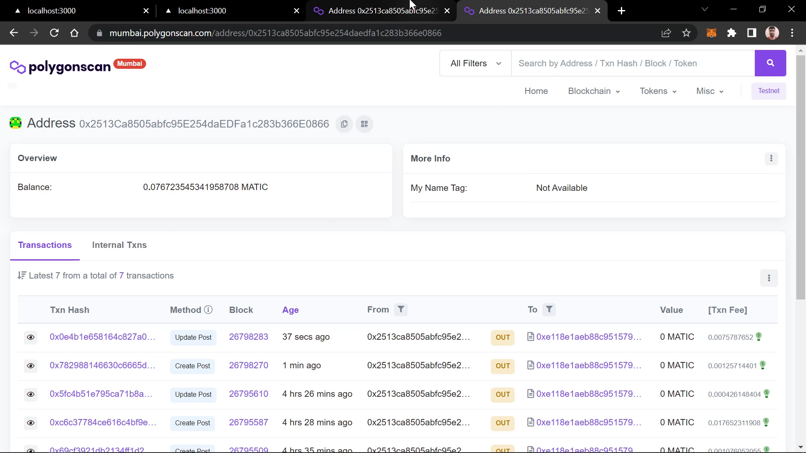

# My web3 Blog


# To deploy this app:

1. Clone this repository
```shell 
git clone git@github.com:dhavalkukreja/web3-blog.git
```

2. Install the dependencies
```shell 
npm install
```


3. Run the local node
```shell
npx hardhat node
```
4. Deploy to localhost
```shell
npx hardhat run scripts/deploy.js --network mumbai
```

5. Start the app
```shell
npm start
``` 
or 
```shell
yarn run dev
```


# Functionalities
## 1. The posts can be viewed by all but created and edited by the owner only
 

## 2. The owner can deploy a post on blockchain and update it.



## 3. The posts can also be edited by the owner



> ## NOTE : 
> *All the transactions can be verified at https://mumbai.polygonscan.com/*
> 
